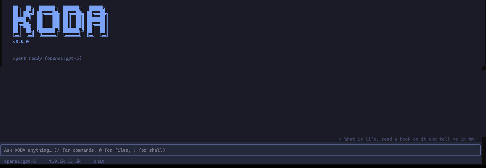

<div align="center">

# KODA

**A universal terminal UI for AI agents — bring your own agent, model, and tools.**

[](LICENSE)
[](https://www.python.org/)
[](tests/)
[](CONTRIBUTING.md)

</div>

<p align="center">
  
</p>

---

KODA is an **agent-agnostic terminal UI** for chatting with tool-using LLMs. The
TUI, session tree, slash-commands, and streaming UX are ours — **the agent
behind it is yours**. Plug in a LangGraph graph, a raw Anthropic or OpenAI
client, a `deepagents` setup, a FastAPI service, or any Python object that
implements a 3-method protocol.

> Think of it as the **front-end of your agent stack**: a clean, hackable shell
> so you can focus on the agent logic, not the UI plumbing.

## Table of contents

- [Why KODA](#why-koda)
- [Features](#features)
- [Install](#install)
- [Quick start](#quick-start)
- [Bring your own agent](#bring-your-own-agent)
- [Supported models](#supported-models)
- [Slash commands](#slash-commands)
- [Project layout](#project-layout)
- [Security](#security)
- [Contributing](#contributing)
- [License](#license)

## Why KODA

Most terminal coding assistants are closed: one model vendor, one agent loop,
one tool set. KODA inverts that — the **interface is the product**, everything
else is pluggable.

- **Any agent, any framework.** One flag `--agent module.build` wires in any
  LangGraph graph, LangChain `AgentExecutor`, raw SDK client, or HTTP/SSE
  backend. No forks, no plugins, no glue code.
- **Frontier-agent primitives built in.** The event protocol streams thinking
  deltas, tool start/result pairs, cumulative token usage, and mid-stream
  cancellation — everything you need for planner/executor splits, subagents,
  reflection loops, and interleaved thinking.
- **Model-agnostic.** Anthropic, OpenAI, Google, Ollama (local), LM Studio, or
  any OpenAI-compatible endpoint. Swap models mid-session with `/model`.
- **Hackable.** Pure Python, ~3k LoC, zero TypeScript, zero browser. Clone,
  `pip install -e .`, iterate.
- **Batteries included.** Slash commands, file autocomplete, session branching,
  markdown logs, jailed filesystem + shell tools, and SSRF-hardened web search
  — all ready on first run.

## Features

| Area | What you get |
|------|--------------|
| **TUI** | Textual-based terminal UI with slash-command menu, `@`-file autocomplete, thinking indicator, live tool-call rendering, and a resizable session sidebar |
| **Sessions** | JSONL session tree with **in-place branching** (`/tree`), sidebar for switch/delete/restore, auto-generated markdown transcripts |
| **Agents** | Built-in `deep` backend (deepagents + LangGraph) — or plug in your own with `--agent mypkg.build` |
| **Models** | Anthropic · OpenAI · Google · Ollama · LM Studio · any OpenAI-compatible endpoint. Model discovery cached (24h TTL) for instant `/model` switching |
| **Tools** | Jailed filesystem (`read_file`, `write_file`, `edit_file`, `ls`, `glob`, `grep`) + shell + Jina-backed web search/read (SSRF-hardened) |
| **Skills** | Drop a `SKILL.md` in `agent_workspace/skills/<name>/` — the agent auto-discovers and uses it |
| **Streaming** | Extended thinking, cumulative usage, mid-stream interrupt (`Ctrl+C`), tool output sanitization |
| **Shell escape** | `!command` runs a shell command directly, bypassing the agent |
| **Extensible** | `KodaAgent` Protocol is ~30 lines. Reference adapters for LangGraph, raw Anthropic SDK, and HTTP/SSE are shipped in `examples/` |
| **Cross-platform** | Tested on Linux, macOS, Windows (CI matrix: Python 3.11 / 3.12 / 3.13) |

## Install

**Requirements:** Python **3.11+**

```bash
# Clone and install in editable mode with your preferred provider(s)
git clone https://github.com/Badar-e-Alam/KODA.git
cd KODA
pip install -e ".[anthropic]"        # or: openai, ollama, google, all
```

Set up credentials:

```bash
cp .env.example .env
# then edit .env and fill in at least one of:
#   ANTHROPIC_API_KEY  OPENAI_API_KEY  GOOGLE_API_KEY  JINA_API_KEY
#   OLLAMA_HOST / OLLAMA_API_KEY (local or Ollama Cloud)
```

## Quick start

```bash
koda                                          # auto-detect model from API keys
koda --model anthropic:claude-sonnet-4-6      # specify provider:model
koda --model ollama:llama3.1                  # local via Ollama
koda --agent mypkg.my_agent.build             # bring your own agent
koda -y                                       # auto-approve tool calls
```

Inside the TUI:

- Type your message and press **Enter** to send
- Press `/` to open the slash-command menu
- Press `@` to autocomplete a filename
- Press `Ctrl+C` to interrupt a running turn
- Type `/quit`, `/exit`, or press `Ctrl+D` to leave

## Bring your own agent

KODA defines a tiny 3-method contract. Anything that satisfies it works:

```python
from typing import AsyncIterator, Any
from koda.agent_api import AgentEvent

class KodaAgent:
    def model_name(self) -> str: ...
    def stream(self, message: str, history: list[dict[str, Any]]
              ) -> AsyncIterator[AgentEvent]: ...
    async def interrupt(self) -> None: ...
```

The easiest path — if you already have a **LangGraph graph**, just return it
from a factory and KODA auto-wraps it:

```python
# myagent.py
def build(model: str = "anthropic:claude-sonnet-4-6"):
    from deepagents import create_deep_agent
    return create_deep_agent(model=model, tools=[...], system_prompt="...")
```

```bash
koda --agent myagent.build
```

For non-LangGraph agents (raw Anthropic/OpenAI SDK, a remote HTTP/SSE service,
a custom planner, …), implement the `KodaAgent` protocol directly. See
[**how_to_doc.md**](how_to_doc.md) for:

- Full protocol reference
- Three worked examples (LangGraph graph, raw Anthropic SDK, HTTP/SSE service)
- Recipes for frontier patterns — planner/executor, subagents, interleaved
  thinking, reflection loops, context compaction

## Supported models

| Provider | Spec example | Notes |
|----------|--------------|-------|
| Anthropic | `anthropic:claude-sonnet-4-6` | Extended thinking supported |
| OpenAI | `openai:gpt-4o` | Any OpenAI model id |
| Google | `google:gemini-2.5-flash` | Gemini 2.5 thinking supported |
| Ollama (local) | `ollama:llama3.1` | Requires `ollama serve` |
| Ollama Cloud | `ollama:glm-5.1:cloud` | Fallback when local is unreachable |
| LM Studio | Auto-detected | `http://localhost:1234/v1` by default |
| Any OpenAI-compatible | via custom adapter | See [how_to_doc.md](how_to_doc.md) |

Model lists are discovered on first use and cached at `~/.koda/models/`
(24h TTL) — `/model` opens instantly after the first run.

## Slash commands

| Command | What it does |
|---------|--------------|
| `/model [spec]` | Switch model (opens picker if no spec) |
| `/tree` | Open session tree; branch or restore history |
| `/skills` | List skills discovered in `agent_workspace/skills/` |
| `/theme` | Cycle through UI themes |
| `/clear` | Clear the current turn buffer |
| `/quit`, `/exit` | Leave the TUI (also `Ctrl+D`) |
| `!<cmd>` | Run a shell command directly (bypasses the agent) |

## Project layout

```
koda/
  __main__.py              CLI entry point + --agent resolution
  agent_api.py             KodaAgent Protocol + AgentEvent union
  tui/app.py               Main Textual application
  tui/stream.py            Event-stream rendering
  adapters/deep.py         Built-in deepagents/LangGraph factory
  adapters/langgraph.py    LangGraph graph → KodaAgent wrapper
  adapters/anthropic.py    Reference raw-SDK adapter
  session.py               JSONL session tree with branching
  tools/fs.py              Jailed filesystem + shell tools
  tools/web.py             Jina-backed search/read (SSRF-guarded)
examples/
  deepagents_backend.py    Minimal BYOA example
  fastapi_agent.py         HTTP/SSE service example
  koda_agent/              Full-featured custom-agent example
  hermes_agent/            Planner/executor example
tests/                     pytest + Textual async UI tests
docs/prompts/              System prompts + tool-loop reference notes
.github/                   CI workflow, issue & PR templates
```

## Security

KODA gives the LLM shell and filesystem access inside a workspace jail
(`./agent_workspace/` by default; override with `KODA_WORKSPACE`). Symlinks
inside the jail are rejected, and `read_webpage` blocks private/loopback/
link-local IPs.

The shell tool itself is **not OS-sandboxed** — treat an LLM-driven shell as
you would untrusted input. For the full threat model and hardening
recommendations, see **[SECURITY.md](SECURITY.md)**.

To report a vulnerability, please follow the process in [SECURITY.md](SECURITY.md)
rather than opening a public issue.

## Contributing

Contributions, issues, and feature requests are welcome. See
[**CONTRIBUTING.md**](CONTRIBUTING.md) for dev setup, code style, and review
expectations, and [**CODE_OF_CONDUCT.md**](CODE_OF_CONDUCT.md) for community
guidelines.

## Acknowledgments

KODA stands on the shoulders of:

- [Textual](https://github.com/Textualize/textual) — the TUI framework
- [LangGraph](https://github.com/langchain-ai/langgraph) and
  [deepagents](https://github.com/langchain-ai/deepagents) — default agent loop
- [Jina AI](https://jina.ai) — web search and reader APIs

## License

[MIT](LICENSE) © 2026 Badar-e-Alam and KODA contributors.
